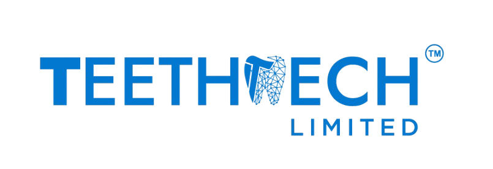

<div align="center">

  

  # TeethTech 🦷

  **The Premier B2B & B2C Dental Supplies, Clinical Equipment & Procurement Platform in Bangladesh**

  [](https://flutter.dev)
  [](https://bloclibrary.dev)
  [](https://pub.dev/packages/go_router)
  [](https://m3.material.io)
  [](#)

</div>

---

## 📖 Overview

**TeethTech** is an enterprise-grade Flutter application engineered specifically for the dental healthcare industry. It bridges dental practices, clinics, hospitals, and individual practitioners with 100% genuine certified dental materials, burs, resins, high-tech curing units, autoclaves, and surgical instruments.

The platform provides a dual-engine purchasing model:
1. **🏥 B2B Enterprise Dental Clinics**: Unlocks tiered wholesale volume pricing, custom Request for Quotation (RFQ) negotiation, Net 30 Days clinic credit lines, and official NBR-registered VAT tax invoices.
2. **🛍️ B2C Individual Dentists & Retail**: Seamless direct purchasing starting from 1 unit (MOQ = 1) with instant bKash/Nagad mobile payments, card gateways, and fast nationwide clinical delivery.
3. **👤 Anonymous Guest Browsing**: Explore 10,000+ catalog products with automated auth-guards protecting checkout and past order history.

---

## ⚡ Quick Start & Installation Guide

Follow these steps to set up and run **TeethTech** on your local machine:

### 1. Prerequisites
Ensure you have the following installed on your development machine:
- **[Flutter SDK](https://docs.flutter.dev/get-started/install)** (Version `3.22.0` or higher)
- **[Dart SDK](https://dart.dev/get-started)** (Version `3.4.0` or higher)
- **Android Studio** (for Android emulator/device) or **Xcode** (for iOS simulator on macOS)
- **Git**

Verify your environment by running:
```bash
flutter doctor
```

---

### 2. Clone the Repository
```bash
git clone https://github.com/hrikhan/teethtech.git
cd teethtech
```

---

### 3. Environment Configuration
Create a `.env` file in the root directory (or copy from existing environment template):
```properties
API_BASE_URL=https://api.teethtech.com.bd/v1
APP_NAME=TeethTech
APP_ENV=development
```

---

### 4. Install Dependencies
Download and link all required Flutter packages:
```bash
flutter pub get
```

---

### 5. Run the Application
Launch the app on a connected physical device or running emulator:

```bash
# Run on default connected device
flutter run

# Run with specific flavor / environment
flutter run -t lib/main.dart

# Run on specific platform
flutter run -d chrome      # Web
flutter run -d windows     # Windows Desktop
flutter run -d android     # Android Device/Emulator
```

---

### 6. Build Production Release (APK / AppBundle)
To build a production release APK for distribution:
```bash
flutter build apk --release
```
The output binary will be generated at:
`build/app/outputs/flutter-apk/app-release.apk`

---

## 🌟 Core App Features

### 🏥 1. B2B Wholesale Pricing & Custom RFQ Workflow
- **Interactive Volume Pricing Tiers**: Products (e.g. *Nitrile Examination Gloves*) feature dynamic 3-column quantity tiers:
  - `1–9 boxes`: ৳500 / box (Standard)
  - `10–49 boxes`: ৳450 / box (10% Tier Discount)
  - `50+ boxes`: ৳400 / box (20% Bulk Tier Discount 🔥)
- **Institutional RFQ Submission**: Clinics can submit customized Request for Quotations (RFQ) with target quantities, required delivery timeline, and clinic specifications.
- **TeethTech Admin Review & Approval**: Procurement managers review RFQs and issue approved proforma quotes with custom discounts and payment terms.
- **1-Tap Quotation Acceptance**: Clinics review quotes and convert them directly into active clinical orders.
- **B2B Corporate Credit Lines**: Supports **Clinic Net 30 Days Credit Term** and **Corporate Bank Transfer / BEFTN**.

---

### 🛒 2. Dynamic Dental Cart & Checkout
- Real-time calculations of subtotal, bulk tier savings in `৳`, 7.5% medical VAT, and express shipping.
- Flexible payment methods:
  - 💳 **Clinic Credit Line (Net 30 Days)** *(B2B Only)*
  - 🏦 **Corporate Bank Transfer / BEFTN**
  - 📱 **bKash & Nagad Merchant Pay**
  - 💳 **Visa, Mastercard & AMEX**
  - 💵 **Cash on Delivery (COD)**

---

### 🚚 3. Live 4-Stage Clinical Shipment Tracking
Track medical equipment and supplies in real time:
1. `Order Placed & Verified` (Clinical review complete)
2. `Clinical Warehouse Packaged` (Batch & expiry certification verified)
3. `Dispatched via Express Courier` (AWB tracking number assigned)
4. `Out for Clinic Delivery` (Temperature-controlled transit box)
5. `Delivered & Received` (Signed by clinic receiving authority)

---

### 📄 4. Digital Business VAT & Tax Invoices
- Itemized breakdowns for verified practices with NBR Registered BIN: `BIN-8809124-CLINIC`.
- In-app interactive invoice modal with 1-click **Download Official PDF Invoice** button.

---

### 🛡️ 5. Role-Based Access Control (RBAC)
- **Guest (Unverified)**: Safe catalog browsing; checkout and order history trigger a secure authentication modal.
- **B2C (Individual Dentist)**: Retail pricing, single-unit orders (MOQ = 1), standard receipts.
- **B2B (Verified Clinic / Practice)**: Unlocks wholesale bulk tables, RFQ procurement hub, and Net 30 credit lines.

---

## 🏗️ Architecture & Technology Stack

The project adheres to **Clean Architecture** with a **Feature-First** modular organization:

```text
lib/
├── main.dart                          # App bootstrap & initialization
└── src/
    ├── app.dart                       # Global MaterialApp with Theme & Router
    ├── config/                        # App config, Dio HTTP client, environment
    ├── core/                          # Base UseCases, Failure classes, Error handling
    ├── features/                      # Modular Feature-First Domain Folders
    │   ├── account/                   # User profile, clinic credentials, settings
    │   ├── auth/                      # Login, Signup, SessionBloc, Role Switcher
    │   ├── cart/                      # Cart items, CartBloc, dynamic tier calculations
    │   ├── catalog/                   # Products, Price tiers, Brands, WishlistBloc
    │   ├── categories/                # Dental categories, subcategory filtering
    │   ├── home/                      # Dynamic auto-carousel, featured products
    │   ├── onboarding/                # Clinical onboarding walkthrough
    │   ├── orders/                    # Order history, OrdersBloc, status filtering
    │   ├── quotations/                # B2B RFQ system, QuotationsBloc, quote review
    │   ├── secondary_shells/          # Product details, Checkout, Order success, Tracking
    │   ├── shell/                     # 5-Tab Persistent Navigation Shell
    │   └── splash/                    # Minimalist animated logo splash
    ├── routing/                       # GoRouter route declarations & guards
    ├── services/                      # Local storage, Secure storage, Version check
    ├── shared/                        # Reusable clinical widgets, buttons, toasts
    └── theme/                         # Material 3 theme, dark mode, colors, typography
```

### Key Libraries & Packages

| Category | Package | Purpose |
|---|---|---|
| **State Management** | `flutter_bloc` | Predictable state management via BLoC pattern |
| **Navigation** | `go_router` | Declarative, deep-linkable routing with sub-routes |
| **Networking** | `dio` | HTTP client with interceptors & certificate pinning |
| **Local Storage** | `shared_preferences`, `flutter_secure_storage` | Session tokens, user preferences |
| **Image Caching** | `cached_network_image` | Memory-efficient remote image loading & placeholders |
| **Localization** | `easy_localization` | Multi-language support (`en`, `es`) |
| **Environment** | `flutter_dotenv` | Secure `.env` configuration management |
| **Equality** | `equatable` | Value equality for BLoC states & domain entities |

---

## 🎨 Visual Identity & Theme System

- **TeethTech Dental Blue**: `#167CD1` (Primary Brand Color)
- **Clinical Emerald Green**: `#00897B` (Savings, In Stock, Quote Approved)
- **Deep Navy Dark Mode**: Material 3 dark surface container architecture
- **High-Contrast Button Typography**: Guaranteed `Colors.white` text on all primary call-to-action buttons across light and dark modes.

---

## 🧪 Testing & Verification

Run automated test suites and static analysis:

```bash
# Run Flutter static analyzer (0 issues enforced)
flutter analyze

# Run unit and widget tests
flutter test
```

---

## 👥 Demo User Accounts (for Testing)

| Role | Email / Credentials | Features Unlocked |
|---|---|---|
| **B2B Clinic** | `clinic@teethtech.com` (Password: `any`) | Wholesale Tiers, RFQ Hub, Net 30 Credit, VAT Invoices |
| **B2C Dentist** | `doctor@teethtech.com` (Password: `any`) | Retail Pricing, Instant Checkout, bKash / Card |
| **Guest User** | Tap *"Continue as Guest"* on Welcome | Catalog Exploration, Cart Building, Auth Guards |

---

## 📄 License

Copyright © 2026 TeethTech Bangladesh. All rights reserved. Proprietary software for clinical dental supply distribution.
